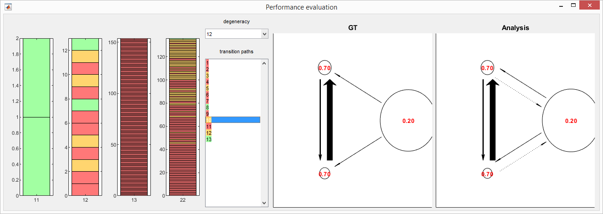

# DPH-test

## Description

DPH-test contains automated routine scripts that controls [MASH-FRET](https://github.com/RNA-FRETools/MASH-FRET) inferace.
These routines are used in order to assess:
1. The use of **discrete phase-type distributions (DPH)** to model in single molecule **kinetic heterogeneity** in ensemble dwell time histogram
2. The accuracy of the **HMM maximum likelihood estimator** (*i.e.*, without further model selection) given by the Baum-Welch algorithm apllied to single molecule **states sequences** (*i.e.*, with a 0-1 binary event matrix)

Both methods are part of the analysis workflow of MASH-FRET's Transition analysis module.

## Method

To address these problems, single molecule state sequences will be simulated with different state degeneracies (goal 1) and for all different transition paths allowed for each state configuration (goal 2). 
Simulated state sequences will be analyzed in MASH-FRET and the analysis output, in terms of number of degenerated states and transition paths, will be compared to the simulation ground truth to evaluate goals 1 and 2

## How to

DPH-test uses MASH-FRET interface. Before running any routine script, perform these two steps:
1. open MASH-FRET by following [these steps](https://rna-fretools.github.io/MASH-FRET/Getting_started.html#installation)
2. add DPH-test to MATLAB's search path by going to `Home → Set Path → Add Folder`

### Simulate 2-state synthetic data sets
with state degeneracies 1-1, 1-2, 1-3 and 2-2 and for all possible transition paths (2, 13, 150 and 150 paths):
1. Run the command: `degenTest_createPresetFiles(3,4,'C:\testdata')` to export simulated preset files with max. 3 degenerated level per state value and max. 4 states in total, and where `C:\testdata` is your destination directory
2. Run the comand `degenTest_generateSimData('C:\testdata')` to simulate and write data sets to files

### Analyze simulated data sets
with MASH-FRET:
Run the command: `degenTest_analyzeSimData('C:\testdata')` to analyze and write results to files

***Note:** The analysis procedure consists in (1) determining state degeneracies by training discrete phase-type (DPH) distributions of complexities 1 to 4 and selecting DPHs that minimize the BIC and, (2) optimizing ensemble HMMs on states sequences with the Baum-Welch algorithm. This took 5 days to complete with an i7 CPU (2.20GHz) and 8GB of RAM.*   
   
### Summarize and evaluate performances 
Run the command `degenTest_analyzeSimData('C:\testdata')` to compare models inferred by MASH-FRET with the ground truth via the graphical interface below:

Green: MASH-FRET found the correct number of degenerated states and the correct transtion path   
Orange: MASH-FRET found the correct number of degenerated states but the wrong transition path   
Red: MASH-FRET found the wrong number of degenerated states
